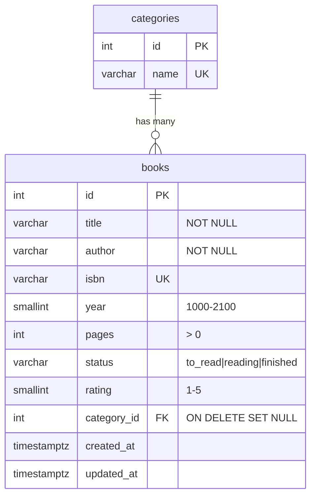

# Book Vault — Database Integration (Project 3)

A persistent CRUD application: **Node.js + Express + PostgreSQL** with a responsive vanilla-JS client
in a white / brown / black palette.

**Author:** Muhammad Shaheer Haider — Senior Full Stack Developer

## Architecture

```
book-vault/
├── db/schema.sql                 # Tables, constraints, indexes, seed categories
├── scripts/migrate.js            # Applies the schema
├── src/
│   ├── config/db.js              # pg connection pool
│   ├── routes/index.js           # URL → controller mapping
│   ├── controllers/              # HTTP layer: parse, validate, respond
│   ├── services/                 # Data-access layer (parameterised SQL only)
│   ├── middleware/errorHandler.js# Central error → HTTP status mapping
│   ├── utils/                    # ApiError, validators
│   ├── app.js                    # Express app (helmet, JSON limit, static, routes)
│   └── server.js                 # Boot + graceful shutdown
├── public/index.html             # Client UI
└── docker-compose.yml            # Local PostgreSQL
```

## Setup

Requires Node.js 18+ and PostgreSQL 14+ (or Docker).

```bash
npm install
cp .env.example .env          # adjust DATABASE_URL if needed
docker compose up -d          # skip if you already run PostgreSQL
npm run migrate               # creates tables and seeds categories
npm run dev                   # http://localhost:3000
```

## Schema



Integrity is enforced **in the database** (`NOT NULL`, `UNIQUE`, `CHECK`, `FOREIGN KEY`) and again in the
API validator, so the database stays the final source of truth.

## API

| Method | Endpoint | Description | Success |
|--------|----------|-------------|---------|
| GET | `/api/books?q=&status=&category_id=&page=&limit=` | List with search, filters, pagination | 200 |
| GET | `/api/books/:id` | Fetch one book | 200 |
| POST | `/api/books` | Create a book | 201 |
| PUT | `/api/books/:id` | Replace a book | 200 |
| DELETE | `/api/books/:id` | Delete a book | 204 |
| GET | `/api/categories` | List categories | 200 |

Body for POST/PUT: `title` and `author` required; optional `isbn`, `year`, `pages`, `status`, `rating`, `category_id`.

| Status | Meaning |
|--------|---------|
| 400 | Malformed JSON, invalid id, or database constraint violation |
| 404 | Book or route not found |
| 409 | Duplicate unique value (e.g. ISBN) |
| 422 | Validation failed (`details` maps field → message) |
| 500 | Unexpected error (details hidden from the client) |

```bash
curl -X POST localhost:3000/api/books -H 'Content-Type: application/json' \
  -d '{"title":"Dune","author":"Frank Herbert","category_id":1,"status":"reading"}'
```

## Security notes

- All SQL uses parameter placeholders (`$1…`), preventing SQL injection.
- Input is trimmed, stripped of control characters, and type/range checked.
- The client renders with `textContent`, request bodies are capped at 10 KB, and `helmet` sets security headers.

© Muhammad Shaheer Haider
